# AIOps with OpenShift on IBM zSystems and LinuxONE

In this tutorial, you will walk become familiar with IBM's three strategic AIOps solutions - Instana, Turbonomic, and IBM Cloud Pak for Watson AIOps - and the capabilities they have to monitor and manage OpenShift on IBM zSystems.

## AIOps Overview

IBM Cloud Pak for Watson AIOps is composed of an **AI Manager** and optional **Event Manager** component, with additional optional add-ons and extensions available for both. IBM Cloud Pak for Watson AIOps can be installed with just the AI Manager features, or with both the AI Manager and Event Manager features. If you require only Event Manager features, you can install a fully containerized, hybrid, or on-premises deployment of Event Manager. Fully containerized and hybrid deployments of Event Manager have advanced event management capabilities.

One of the optional add-ons is **Infrastructure Automation**. This Infrastructure automation component consists of the following components, which previously were available with IBM Cloud Pak for Multicloud Management:

 - **Infrastructure management**, previously called IBM Red Hat CloudForms.
 - **Managed services**, previously called Terraform & Service Automation or IBM Cloud Automation Manager.

*Infrastructure management* delivers the insight, control, and automation enterprises need to address the challenges of managing virtual environments, which are far more complex than physical ones. This technology enables enterprises with existing virtual infrastructures to improve visibility and control, and those just starting virtualization deployments to build and operate a well-managed virtual infrastructure.

*Managed services* provide you with the capability to automate provisioning of infrastructure and virtual machine applications across multiple cloud environments with optional workflow orchestration.

Infrastructure Automation is the one component of IBM Cloud Pak for Watson AIOps that is supported to run on OpenShift on IBM zSystems. AI Manager and Event Manager currently only run on x86-based clusters.

For more information, see the [IBM Cloud Pak for Watson AIOps Architecture page](https://www.ibm.com/docs/en/cloud-paks/cloud-pak-watson-aiops/3.6.2?topic=overview-architecture)

This tutorial focuses on the AI Manager component of CP4WAIOps - Event Manager and Infrastructure automation are not included.

## Environment Overview


## Exploring the Robot Shop Sample Application

1. **Open a web browser such as Firefox.**

2. In the browser, **navigate to your OpenShift console.** 

    The OpenShift console typically begins with `https://console-openshift-console-`. Reach out to your OpenShift administrator if you do not have this address.

    You will now see the OpenShift console login page.

    

3. **Log in with your OpenShift credentials.**

4. **Under the developer perspective, navigate to the Topology page for the `robot-shop` project.**

    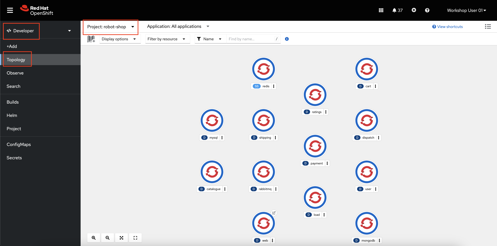

    Robot Shop is a simulated online store where you can purchase robots and AI solutions. Robot Shop is a polyglot - meaning it is made up of many different microservices that were written in different programming languages. There are 12 different microservices written in languages including NodeJS, Python, Spring Boot, and Go, along with containerized databases including MongoDB, MySQL, and Redis. Each icon in the Topology represents an OpenShift deployment for a specific microservice. Each microservice is responsible for a single function of the Robot Shop application that you will see in the following steps.

5. **Open the Robot Shop web application by clicking the small button in the top right of the `web` icon.**

    This is simply a hyperlink that will take you to the Robot Shop application homepage.

    

    The Robot Shop homepage should appear like the screenshot below, with all of the same options in the left side menu.

    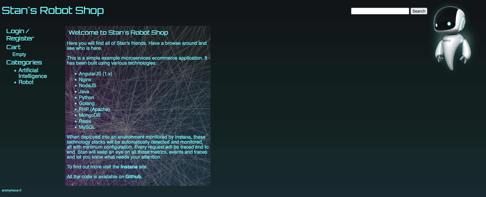

6. **Explore the website and its functionalities from the left side menu.**
   
    You can register a new user, explore the catalog of purchasable robots, give them ratings, and simulate a purchase.

    Notice that from the OpenShift and Robot Shop perspectives, you don't get much of a sense of how the various microservice applications are plumbed together, how they are performing, if they have the correct number of resources, or if any issues are affecting the application currently or in the near future. In other words, there is a lack of *observability*, *application performance management*, and *proactive problem remediation*.

## Instana

### Overview of Instana Observability

Instana is an enterprise observability solution that offers application performance management - no matter where the application or infrastructure resides. Instana can monitor both containerized and traditional applications, various infrastructure types including OpenShift, public clouds & other containerization platforms, native Linux, z/OS, websites, databases, and more. The current list of supported technologies can be found [in the Instana documentation](https://www.ibm.com/docs/en/obi/current?topic=supported-technologies).

For this tutorial, we have set up an environment that includes Instana running on a Linux server which is monitoring an OpenShift on an IBM zSystems cluster through an Instana agent which you will look at in the next section.

### Viewing the Instana Agent on OpenShift

7. In the OpenShift cluster, **navigate to the `instana-agent` project then click the circular icon in the Topology page.**

    

    This is the Instana agent that is collecting all the information about OpenShift and the containerized applications running on it and then sending that information over to the Instana server.
    
    The agent is deployed as a [DaemonSet](https://kubernetes.io/docs/concepts/workloads/controllers/daemonset/), which is a Kubernetes object that ensures one copy of the pod runs on each compute node in the cluster. Each individual Instana agent pod is responsible for the data and metrics collection for the compute node they run on.

8. **Click the `view logs` hyperlink next to one of the pods in the right-side menu.**

    ```text
    2023-03-01T17:13:46.589+00:00 | INFO | stana-agent-scheduler-thread-9-1 | turesManagerImpl | com.instana.agent-bootstrap - 1.2.25 | Installed instana-kubernetes-sensor
    2023-03-01T17:13:46.593+00:00 | WARN | stana-agent-scheduler-thread-9-1 | yDiscoveryTicker | com.instana.agent - 1.1.677 | Discovery for com.instana.plugin.kubernetes took too long (28512 ms)
    2023-03-01T17:13:46.608+00:00 | INFO | 7c9-865d-446b-8ad9-ada0c5fb7a59) | Kubernetes | com.instana.sensor-kubernetes - 1.2.139 | Activating Kubernetes Sensor
    2023-03-01T17:13:46.662+00:00 | INFO | 7c9-865d-446b-8ad9-ada0c5fb7a59) | Kubernetes | com.instana.sensor-kubernetes - 1.2.139 | Using master url https://172.30.0.1:443/
    2023-03-01T17:13:47.152+00:00 | INFO | 7c9-865d-446b-8ad9-ada0c5fb7a59) | Kubernetes | com.instana.sensor-kubernetes - 1.2.139 | Subscribed to leadership events
    2023-03-01T17:13:47.997+00:00 | INFO | tana-sensor-scheduler-thread-2-2 | ableResourceInfo | com.instana.sensor-kubernetes - 1.2.139 | Start watching pods on node compute-0.atsocpd1.dmz...
    2023-03-01T17:13:50.950+00:00 | INFO | stana-agent-scheduler-thread-9-1 | turesManagerImpl | com.instana.agent-bootstrap - 1.2.25 | Installed instana-host-sensor
    2023-03-01T17:13:51.080+00:00 | INFO | 74c-6ecc-49c2-995a-e57f52e12cdb) | Host | com.instana.sensor-host - 1.1.147 | Activated Sensor
    2023-03-01T17:13:53.975+00:00 | INFO | stana-agent-scheduler-thread-9-1 | turesManagerImpl | com.instana.agent-bootstrap - 1.2.25 | Installed instana-gcp-services-discovery
    2023-03-01T17:13:53.984+00:00 | WARN | stana-agent-scheduler-thread-9-1 | yDiscoveryTicker | com.instana.agent - 1.1.677 | Discovery time (58652 ms)
    2023-03-01T17:14:15.061+00:00 | INFO | c66-b1ef-4bc0-bc2a-b810abc8cdd3) | Crio | com.instana.sensor-crio - 1.0.10 | Activated Sensor 7f31b2cbe57b25720a4faf38ca86003fbd940c86d56cf02f78ed752d5e409dcd
    2023-03-01T17:14:15.105+00:00 | INFO | 8f9-dbcf-4c46-b04d-f396b7f048a2) | Crio | com.instana.sensor-crio - 1.0.10 | Activated Sensor 5aac7fe96187321e5302478dbfc64feda35d108e59b6c3dc0c42f094435ecd7b
    2023-03-01T17:14:15.110+00:00 | INFO | 61d-5569-47e8-9196-8128bb8944c5) | Crio | com.instana.sensor-crio - 1.0.10 | Activated Sensor 7034d4698290b57385bcc5a85fca3faa4fd0605a24046ac15b4bd6c9a436813a
    2023-03-01T17:14:15.115+00:00 | INFO | c3b-a47a-4856-acef-c8a8b8d3882a) | Crio | com.instana.sensor-crio - 1.0.10 | Activated Sensor 3dbe00e2b1da3d427deaaa9321ef3ad88ba5fecd6eac47483da89e4a50375ab5
    2023-03-01T17:14:15.207+00:00 | INFO | 0c7-c787-45c4-912d-dd8f93c24d66) | Crio | com.instana.sensor-crio - 1.0.10 | Activated Sensor e49ed98a6c4cf6271d009488d9292858912602915af4be8772664d24d4f36f68
    2023-03-01T17:14:15.253+00:00 | INFO | ab0-768f-42e8-a27b-96f4f149b22d) | Crio | com.instana.sensor-crio - 1.0.10 | Activated Sensor 3268dbca7f621f728066d2e0d73bc5cdc803f3ea218e49d997bcb4519f2058df
    ```

    If you would like to see what data the agents are collecting or if you need to debug issues with collecting data from certain workloads running on OpenShift, these pod logs are a good first place to look.

    In the next section, you will take a look at the other side of the OpenShift Instana agent - the Instana server that is receiving the data.

### Navigating the Instana Dashboard

9. **In a web browser, navigate to your Instana server. Reach out to your Instana administrator if you do not have this address.**

10. **Log in with your Instana credentials.**

    When you first log into Instana, you will be taken to the Home Page. This is a customizable summary page that shows the key metrics for any component of your environment in the timeframe specified in the top right of the screen.

    

11. **Set the time frame to Last Hour and click the Live button.**

    You are now seeing metrics for our environment over the previous hour, and it is updating in real time.

    The next thing to notice is the menu on the left side of the page. If you hover over the left side panel, you will see a menu of links that will let you dive into different sections of the Instana dashboard, rather than seeing every option.

12. **Click the left side panel so the menu appears.**

    

    Next, you will go through each section in the menu.

13. **Click the Websites & Mobile Apps option.**

    **Note: website monitoring is currently not configured for this tutorial. This step and the following were left in for completeness.**

    

    You can see that Instana is monitoring one website named Robot Shop Website. This is the set of webpages associated with the Robot Shop sample application we have deployed on OpenShift on IBM zSystems. Instana supports website monitoring by analyzing actual browser request times and route loading times. It allows detailed insights into the web browsing experience of users, and deep visibility into application call paths. The Instana website monitoring solution works by using a lightweight JavaScript agent, which is embedded into the monitored website.

14. **Click the Robot Shop Website hyperlink.**

    

    If the page is empty, navigate back to the Robot Shop website from the OpenShift topology page and click around the site to generate data.

    After interacting with the webpages, we now see metrics for page loads and transitions, loading times, any errors, and many more performance indicators. Within this website, there are all kinds of filters and tabs with more information.

15. **Navigate through the various tabs to show more data - Speed, Resources, HTTP requests, and Pages.**

    What we've seen so far is all related to the *website* metrics, not the *application* itself. In the next section, we will dig into how the application running on OpenShift on IBM zSystems is running.

16. **Click the Applications option in the left side menu.**

    

17. **Click the Robot Shop Microservices Application hyperlink.**

    An application perspective represents a set of services and endpoints that are defined by a shared context and is declared using tags. For example, in this tutorial, the Robot Shop Microservices application perspective encompasses all services and endpoints that meet the tag `kubernetes-namespace=robot-shop`. Because all of our containerized microservices are running in an OpenShift namespace named `robot-shop`, they all appear in this application perspective. This is a very simple example of a tag, and it works because we only have one Kubernetes (OpenShift) cluster, so only one namespace named `robot-shop`. If we had another cluster with a namespace of the same name, we might want to add another tag to select the Kubernetes cluster's zone or name.

    Alongside the Robot Shop application running in OpenShift, there is a container running a Python application that generates load to each microservice. The metrics you see now in the application perspective are coming from that load generator. At the top of the page, you can see the total number of calls, the number of erroneous calls, and the mean latency for each call over the past hour. Based on the number of total calls, you can see that Instana is able to monitor an incredible amount of data in real time and provide actionable insights against it. Each chart can be interacted with in various ways. For example, the total calls graph can be filtered by return code.

18. **Click to hide each return code other than `500`.**

    

    As with the Websites & Mobile Applications section, the Application perspective has various tabs that contain different information. When it comes to microservices, one of the most helpful tabs in the Application perspective is the Dependency graph.

19. **Click the Dependencies tab.**

    

    The dependency graph offers a visualization of each service in the Application perspective, which services interact with each other, and also some visual representations of errors, high latency, or erroneous calls. You can select these options in the top left of the graph.

20. **Click the dropdown labeled None and select Max Latency.**

    

    You can now see that the cities microservice is the largest contributor to application latency. There are more tabs in the Application perspective related to each individual service, error and log messages, the infrastructure stack related to the tag we specified, and options to configure the Application perspective.

21. **Click through each of the tabs.**

    If you pay attention while clicking through these tabs, you will notice that the payments service has an unusually high number of erroneous calls, but we'll get to that in a later section.

22. **Click the Platforms -> Kubernetes option in the left side menu.**

    

23. **Click the openshift (cluster) hyperlink.**

    OpenShift and other Kubernetes clusters are monitored by simply deploying a containerized Instana agent onto the cluster. Once deployed, the agent will report detailed data about the cluster and the resources deployed into it. Instana automatically discovers and monitors clusters, CronJobs, Nodes, Namespaces, Deployments, DaemonSets, StatefulSets, Services, and Pods.

    The Summary page shows the most relevant information for the cluster as a whole. The CPU, Memory, and Pod usage information are shown. The other sections, such as "Top Nodes" and "Top Pods" show potential hotspots which you might want to have a look at.

24. **Click the Details tab.**

    The Details tab displays information about the health of critical components of the Kubernetes cluster, such as the controller, scheduler, and etcd.

25. **Click the Events tab.**

    The Events tab shows all of the Kubernetes events in the cluster in real time. It also provides links to the related objects for quick access. The remaining tabs are all Kubernetes objects in the cluster and the metrics displayed depend on the object type.

26. **Click through the tabs to show various objects and their metrics.**

    Instana also supports monitoring of Cloud Foundry and VMWare Tanzu clusters, but that is outside the scope of this demonstration.

27. **Click the Infrastructure option in the left side menu.**

    

    You will be taken to the Infrastructure map. The Infrastructure map provides an overview of all monitored systems, which are initially grouped by options of your choice. Within each group are pillars comprised of opaque blocks. Each pillar as a whole represents one agent running on the respective system. Each block within a pillar represents the software components running on that system and will change color to reflect the component's health.

28. **With the filters in the bottom right of the page, select the Host Perspective and OS architecture for Grouping.**

    

    Now we are looking at the three monitored systems grouped by architecture. Each block within the pillars is a single process or microservice. Let's take a different look at the OpenShift cluster.

29. **Select the Container Perspective and Grouping by Kubernetes Namespace.**

    

    This is a better view of the containerized processes running in our monitored environment. As you might be able to tell by the color coding of the different processes or microservices, we have a few errors with the Robot Shop application. We'll come back to this page in a later section to debug.

30. **Click the Analytics option in the left side menu.**

    Instana includes a very powerful AI-driven analytics solution out of the box. These analytics are integrated into each of the panels we've looked at so far, but you can also directly access them from the menu.

    

    By default, we're taken to a built-in dashboard for analytics related to Application calls. We can filter by using the left side options, or by creating our own filters at the top.

31. **Expand the left side options and select Only Erroneous and the Robot Shop Microservices application.**

    

    The source of some of our payment errors is starting to become apparent.

32. **Click the Events option in the left side menu. Click on Incidents if you aren't automatically taken there.**

    

    

    Instana can parse all of the requests, calls, traces, and other information it knows about into a stream of events and then classify and group them. Instana includes built-in events, predefined health signatures based on integrated algorithms which help you to understand the health of your monitored system in real-time. If a built-in event is not relevant for the monitored system, it can be disabled. Conversely, you can create a custom event in Instana if it does not already exist. These events can then be sent as an alert to a channel of your choice, such as email, Slack, Watson AIOps, Splunk, PagerDuty, Prometheus a generic webhook, or one of many more supported technologies.

    Right now we're looking at Incidents that Instana has identified during our timeframe. Incidents are created when a key performance indicator such as load, latency, or error rate changes over a certain threshold.

33. **Navigate back to the Events page and select the Issues tab.**

    

    An issue is an event that is triggered if something out of the ordinary happens. You can think of Incidents as Issues that Instana has correlated with each other to form a cohesive event. Let's take a look at a single Issue.

34. **Navigate back to the Events page and select the Changes tab.**

    

    A Change is an Event where Instana recognizes a change in configuration or status of a component it is monitoring, such as a deployment, pod, node, or server. Changes can be correlated with Issues under the umbrella of an Incident.

    This is the end of the navigation portion of this demonstration, so next we will start to put this knowledge to use. We just looked through a small portion of what Instana offers, but you now have a general sense of the capabilities Instana offers and how each is tied to one another through AI-driven algorithms and rules.

### Using Instana to Identify an Issue

As you looked through the various sections of the Instana dashboard, a few errors kept popping up. In this section, we will use Instana to pinpoint the root cause of the errors and fix them. When debugging with Instana, a good place to start is Events.

37. Click the Events option in the left side menu. Click on Incidents if you aren't automatically taken there.

    

    Instana has identified Incidents for us to look into.

38. **Click one of the Incidents titled "Erroneous call rate is too high".**

    

    The incident page shows a dynamic graph of all associated issues, events, and correlates it with other incidents to provide a comprehensive overview of the situation regarding service and event impact.

39. **Click to expand the triggering event.**

    

    Instana automatically displays a relevant dynamic graph. In our case, this is the erroneous call rate for the payment service. Instana also provides a link to the analysis page for these calls.

40. **Click the "Analyze Calls" button.**

    Now we're back on the Analysis page we looked at previously, but with the correct filters automatically applied. We can see that the POST /pay/{id} endpoint has 100% erroneous calls. Click to expand that dropdown.

    

    Notice how we see the same information about the erroneous calls for POST /pay/partner-57 as we did previously, but Instana did all of the thinking and filtering for us. Because of the 100% error rate, it's clear that this endpoint is having an issue. Instana also provided us with links to the specific calls that failed.

41. **Click one of the "POST /pay/partner-57" links.**

    

    On the call page, we see how many instances of the erroneous call there are, a trace of the call and at which point the error occurred, the status code and error messages received, and more. From reading through the information on this page, we learn that the source of the error is the payment service in Kubernetes. The related endpoints and infrastructure such as the external MongoDB and the user service look healthy.

42. **Click the "payment" link under "Service Endpoint List".**

    

    And again, we confirm that the payment service in OpenShift is the root cause of these Incidents. At this point we would want to look at our Kubernetes YAML definitions and the python code that was containerized and is running this microservice. For the sake of this demonstration, we know that the error is caused by an intentional bug built into the load generator which is attempting to access a payment endpoint that does not exist.

### Instana Wrap-up

You should now have a better understanding of Instana observability, how to use the platform, and the OpenShift on IBM zSystems data and metrics it can observe. The deep and broad observability provided by Instana set the stage for other IBM solutions to **use that data** to make AI-driven insights around application performance and problem remediation.

## Turbonomic

### Overview of Turbonomic Application Resource Management 

Turbonomic is IBM's solution for Application Resource Management (ARM) of cloud and on-premises environments.

Application Resource Management is a top-down, application-driven approach that continuously analyzes applications' resource needs and generates fully automatable actions to ensure applications always get what they need to perform. It runs 24/7/365 and scales with the largest, most complex environments.

To perform Application Resource Management, Turbonomic represents environments holistically as a supply chain of resource buyers and sellers, all working together to meet application demand. By empowering buyers (VMs, instances, containers, and services) with a budget to seek the resources that applications need to perform, and sellers to price their available resources (CPU, memory, storage, network) based on utilization in real-time, Turbonomic keeps environments within the desired state. Turbonomic enables environments to achieve the following conflicting goals at the same time:

- Assured application performance
        
    Prevent bottlenecks, upsize containers/VMs, prioritize workload, and reduce storage latency.

- Efficient use of resources
    
    Consolidate workloads to reduce infrastructure usage to the minimum, downsize containers, prevent sprawl, and use the most economical cloud offerings.

Turbonomic is a containerized, microservices architected application running in a Kubernetes environment. You then assign services running on your network to be [Turbonomic targets](https://www.ibm.com/docs/en/tarm/8.7.5?topic=overview-turbonomic-targets). Turbonomic discovers the entities (physical devices, virtual components and software components) that each target manages, and then performs analysis, anticipates risks to performance or efficiency, and recommends actions you can take to avoid problems before they occur.

[Source and more information](https://www.ibm.com/docs/en/tarm/8.7.5?topic=documentation-product-overview)

### Navigating the Turbonomic Dashboard

#### Homepage

43. **Navigate to the Turbonomic platform home page.**

    When you first log into Turbonomic, you are taken to this home page. Because you are logged in as a user with "Advisor" credentials, you can see everything that Turbonomic is managing, but you cannot take actions against the target environments or modify the Turbonomic server itself. You could set up more users either locally on the Turbonomic server or with an authentication such as LDAP. These new users can have their access scoped to certain environments, applications, or specific entities on the Turbonomic server so people can only access what they need to.

    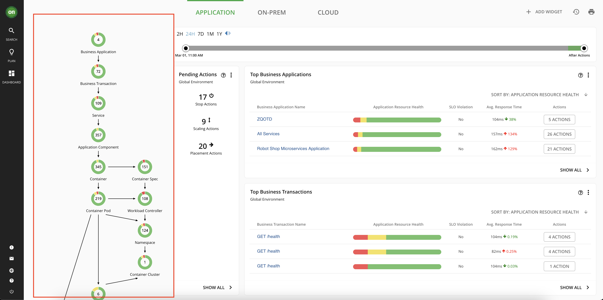

    The first thing to notice is the supply chain on the left side of the page. As discussed in the previous section, Turbonomic uses the concept of a supply chain made up of buyers and sellers all with the goal of meeting application resource demand. The supply chain shown on the homepage includes all the entities that Turbonomic identified based on deployment of the KubeTurbo operator on the OpenShift on IBM zSystems cluster. The relationships and interdependencies between each entity were automatically identified and provide an overview of how each object relates to one another. Because we are monitoring an OpenShift cluster, we can see our application and cluster infrastructure components were found including containers, namespaces, persistent volumes, and the single virtual machine running our cluster's combined compute/control plane node. This is an interactable chart so you can click on any of the entity types to drill down directly from the homepage.

    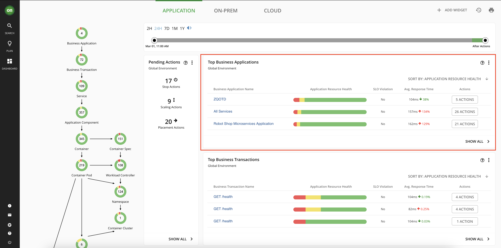

    On the right side of the page, you can see there is a "Business Application" listed with the name `Robot Shop Microservices Application`. A Business Application is a Turbonomic concept, not an OpenShift one. Business Applications can be defined in Turbonomic as a group of related objects of your choosing. In the case of this demonstration, our Business Applications are imported from the Instana Application Perspectives, as well as all the related entities that Turbonomic correlated with them, such as the virtual machine the pods are running on, the namespace (project) they're running in, the persistent volumes where they store data, and the Kubernetes cluster itself. This is one example of the integration between Instana and Turbonomic.

    Using Instana alongside Turbonomic in this way brings other benefits as well, such as letting Turbonomic see the application response times and transaction speeds and then use that data to horizontally scale pod counts to meet defined Service-Level Objectives (SLOs). Without Instana or another Application Performance Monitoring (APM) solution in place, you would not have any visibility into application response times or metrics, and the Turbonomic capabilities would be more limited.

    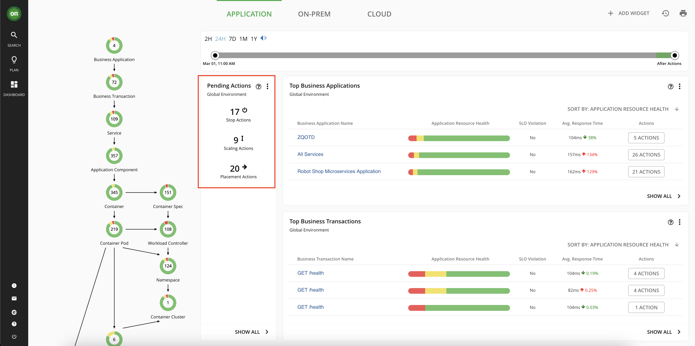

    Near the middle of the page, you will see a section titled "Pending Actions". These are all the actions that Turbonomic is recommending we take against the OCP on IBM zSystems cluster to make sure our applications get the resources they need but aren't over-provisioned. You will learn more about actions later in this tutorial.

    Let's start looking around the other pages in the Turbonomic console.

#### Search

44. **In the left side menu, select the Search option.** 

    On the search page, we can filter down to specific types of entities that Turbonomic has identified. For example, if we look at Namespaces, it will return all the namespaces, or projects in OpenShift nomenclature, in our target cluster.

45. **Select the Namespaces option in the list.**

    

    Let's dig into the namespace that contains the Robot Shop sample application.

46. **Select the `robot-shop` namespace.**

    

    We now have a view that is scoped to only the components running in the robot-shop namespace, as well as any related components that those pods interact with, such as virtual machines, storage volumes, and more. We are provided all the actions against these components, the top services and workload controllers by CPU and memory for the robot-shop components, information about any quotas assigned to the project, and more. If you want to scope down an individual's access to a single application, only workloads in a specific datacenter, or a custom group of workloads and components you define, this is an example of what that could look like.

47. **Scroll through this page looking at the provided charts and tables.**

#### Plan

48. **In the left side menu, select the Plan option.**

    Turbonomic Plans allow you to run "what if" scenarios that explore the potential impact that actions would have on your target environments. For example, if you added a new compute node to the OpenShift on IBM zSystems cluster, changed the memory and CPU resources for certain Robot Shop pods, and moved certain pods from one node to another, how would that impact your overall resource consumption? What would the impact be to cost? Would it help you meet your SLOs?

    Plans are a powerful tool to understand the impacts of actions you may take. Let's see what happens when we create one now.

49. **Click the New Plan button.**

    Turbonomic automatically recognized that we have a container cluster (OpenShift) as a target, so it offers us the pre-built "Optimize Container Cluster" plan.

50. **Click the "Optimize Container Cluster" option.**

51. **Select the Kubernetes-<cluster_name> option, then click the "Next: Optimization Settings" at the bottom of the page.**

    `<cluster_name>` will depend on the name of your target OpenShift cluster.

    

    We're given three default options for how to optimize the OpenShift on IBM zSystems cluster. The option we choose will depend on the environment we have and what types of options are authorized for each individual.

52. **Select the Optimize Cluster Resources, Placement and Nodes option and then Run Plan.**

    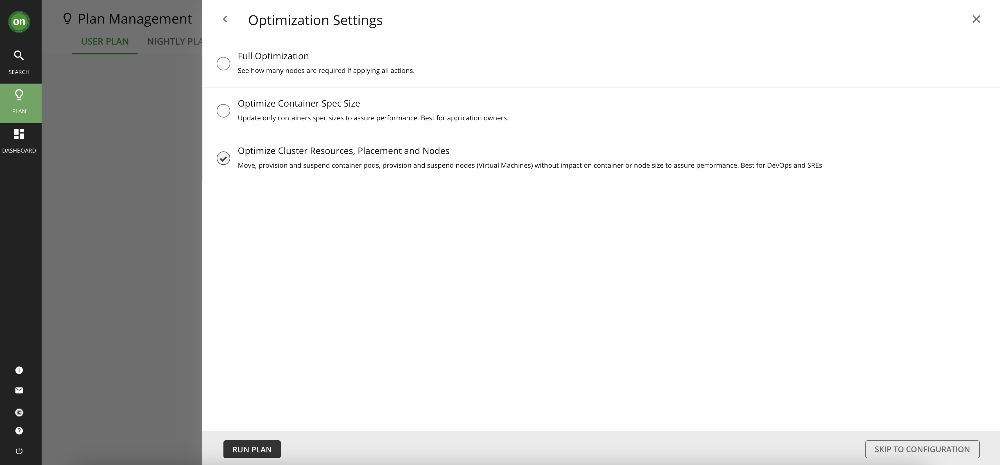

    After the plan runs, we're told what our configuration parameters were - which settings were enabled or disabled - and the summary of the impact that the plan actions would have on the cluster. We can scroll through this page to see more details about the individual actions and before-and-after scenarios for different cluster metrics.

53. **Scroll through this page looking at the different tables and charts.**

We've seen actions on a few different pages in the Turbonomic platform so far, and we'll come back to these in more detail after making our way through the dashboard.

#### Dashboard

55. **In the left side menu, select the Dashboard option.**

    Turbonomic Dashboards provide views of the target environments based on certain personas or environment types. These are particularly helpful when there are many different types of targets being managed, because the global scope from the Turbonomic homepage can provide too much information that might not be relevant to everyone. There are a few built-in dashboards that comes pre-installed, or you can create your own custom dashboards that display specific information you pick.

56. **Select the Container Platform Dashboard option.**

    On the default Container Platform Dashboard, we have views of all the clusters Turbonomic is managing (only the one IBM zSystems cluster in this demonstration) and the top namespaces and services by resource usage, along with any actions correlated with entities within those namespaces.

    

#### Settings (for information only)

**This section cannot be completed by users with an "Advisor" credential. They are left in this tutorial for education and completeness.**

57. **In the left side menu, select the Settings option.**

    The settings page is where administrators can manage the Turbonomic platform itself, including adding new targets, creating groups of resources, editing policies to suit your organization, creating new users or integrating with LDAP, and more. Let's take a look at the Policies.

58. **Select the Policies option in the top row.**

    Here we see all the default policies for each entity type that Turbonomic can manage. These policies are what determine what actions are generated, what thresholds must be met for the actions to be generated, and more. The policies are specific to each entity type, let's take Virtual Machines as an example.

59. **Select the Virtual Machines Defaults option in the list.**

    

    The first thing we see is the Action Acceptance settings for each potential action. The three action "Modes" are Recommend, Manual, or Automatic. Recommended actions simply recommend the action for users to take. Users then would need to go into OpenShift, the Linux guest, the application, or the hypervisor and perform the action through the appropriate means on the platform. Manual actions are quite similar in that they recommend an action to take, but they also provide an option to execute that action through the Turbonomic user interface. Automatic actions execute the actions automatically, without waiting for any intervention or confirmation from users. You can also disable an action type completely if you don't want them to be considered by Turbonomic or offered to users.

    

    Further down in the options, we see the constraints that can be modified for actions against virtual machines. These are used to set minimum and maximum bounds for VPU and memory values, target utilization, and more. Each entity type has its own policy with different configurable options that determine how Turbonomic acts.

#### Groups (for information only)

**This section cannot be completed by users with an "Advisor" credential. They are left in this tutorial for education and completeness.**

60. **Navigate back to Settings and then select Groups.**

    

    Looking in the Groups option in the Settings you can see that we have a Group named "Robot Shop Container Pod Group". This is a custom group we set up ahead of time that is made up of all pods in namespaces called `robot-shop`. This is a very simplistic example of a group - you could make it more targeted, for example by specific clusters (if we had more than one), or you could create a group made up of multiple entity types, such as containers on OpenShift clusters as well as databases on Virtual Machines.

#### Application Topology (for information only)

**This section cannot be completed by users with an "Advisor" credential. They are left in this tutorial for education and completeness.**

61. **Navigate back to Settings and then select Application Topology.**

    

    You can see that a custom Business Application can be defined by the custom Group we just looked at. Again, this is a simplistic example, and we could make it more targeted or more inclusive of other entity types if we wished.

    We've reached the end of the Turbonomic Platform mini tour. If you'd like more details about any of these capabilities, there is much* more information included in the "Getting Started" pages of the [Turbonomic documentation](https://www.ibm.com/docs/en/tarm/8.7.5?topic=documentation-getting-started).

    Next, we'll learn about what kinds of actions Turbonomic can generate against an OpenShift on IBM zSystems cluster.

### Turbonomic Actions

#### What are Actions?

After you deploy your targets, Turbonomic starts to perform market analysis as part of its Application Resource Management process. This holistic analysis identifies problems in your environment and the actions you can take to resolve and avoid these problems. Turbonomic then generates a set of actions for that particular analysis and displays it in the Pending Actions charts for you to investigate.

[Source and more information](https://www.ibm.com/docs/en/tarm/8.7.5?topic=started-turbonomic-actions)

#### What Actions are Available for OpenShift on IBM zSystems Targets?

There are different action types for different target environments, and not all of them apply to OpenShift on IBM zSystems. For example, Turbonomic can generate actions to scale cloud VMs to instance types that have discounted rates to reduce cloud consumption costs. This type of action is simply out of scope for an OpenShift cluster running on-premises, as is the case with most IBM zSystems clients.

For OpenShift on IBM zSystems, Turbonomic can generate the following actions:

- Vertically Scale Containers - resize container spec sizes

    If a containerized application needs more CPU or memory to ensure it's running with desired performance, Turbonomic can scale up the container spec. In OpenShift terms, this means adjusting the resource requests and/or resource limits applied to the application pods. The reverse is just as important - if a container is overprovisioned - if it has too much CPU or memory assigned to it - these resources are going to waste. Overprovisioning is a common issue in the containerized world, and it leads to inefficient use of resources, lack of resources for other applications that need it, and wasted money.

    This is the action that we will be demonstrating later in this section.

- Horizontally Scale Containers - Scale up the number of pods for a microservice

    If there is a Service Level Objective (SLO) configured for a containerized application, Turbonomic can scale the number of pods up or down in order to meet the demand at any given moment.

    An APM solution such as Instana is required for this action type. Turbonomic needs metric data from the APM about response time and transactions speeds in order to enforce SLOs.

- Pod Moves - move a pod from one node to another where more resources are available.

    One of the fundamental functionality gaps in Kubernetes (and therefore OpenShift), is the lack of pod rescheduling based on node resources. The Kubernetes scheduler decides where to place pods only at the time they are initially deployed. Pods will then stay on that same node for their lifecycle, no matter what changes on the node, what else is deployed afterwards, or how much the applications resource usage changes over time. Kubernetes will only move pods to new nodes at the point where it starts evicting pods due to severe lack of resources - there is no proactive movement, and the pod eviction results in application downtime until the new pod is spun up elsewhere.
    
    Turbonomic addresses this gap by continuously moving pods based on node resources available. The moves are performed in a way that keeps the application available throughout the move. Once executed, Turbonomic will start a new pod on the destination node -> ensure that it is running and ready -> deletes the original pod. This way, there is no perceived downtime to the application end user.

    There are some caveats here as it relates to RWO persistentVolumes and statefulSets, and can read more information in the KubeTurbo wiki [here](https://github.com/turbonomic/kubeturbo/wiki/Action-Details#pod-move-actions-that-assure-availability).

- Cluster Scaling - Provisioning or Suspending OpenShift Nodes

    Turbonomic will also generate actions to create new nodes in the OpenShift cluster or suspend existing nodes based on its analysis of efficiency (consolidating workloads onto fewer nodes), performance (avoiding node congestion), and the node selection policies configured in the Turbonomic settings. Similar to vertical container scaling, cluster scaling can certainly impact cost (more or less hardware and resources being used), and performance (more or less resources available to applications).

    When it comes to OpenShift on IBM zSystems, Turbonomic will only *recommend* actions related to cluster scaling. Turbonomic relies on OpenShift machine autoscaling which is not supported on IBM zSystems. Therefore, if a node provision/suspension action is generated for an IBM zSystems cluster, administrators will need to perform that action themselves with traditional, manual methods, and then Turbonomic will see that change and reflect it.

    Turbonomic does, however, support using actions to create calls to third party workflow orchestrators such as Ansible, Terraform, or ServiceNow, if you are so inclined.

#### Manually Executing Actions

As we saw throughout the tour of the Turbonomic platform, we have some pending actions related to the Robot Shop sample application running on the IBM zSystems cluster.

62. **Navigate to the home page and notice the pending actions.**

    Because we're looking at the home page right now, this represents the pending actions for the global environment. That means that these actions could be targeting workloads in the cluster other than the Robot Shop application. Fortunately, we know that we have a Business Application configured that will scope our view down to just Robot Shop.

63. **Click the Robot Shop Microservices Business Application.**

    Now we'll only see the pending actions that we're currently interested in. 

64. **Click the Pending Actions just to the right of the supply chain chart.**

    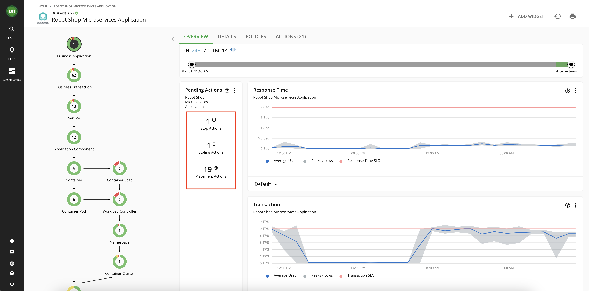

    As you can see, all of the actions here are related to the robot shop microservices. Some are related to CPU resizing, and some are related to memory resizing, but all of them want us to increase their allotted resources for the sake of application performance. Let's look at one for example.

65. **Click the details button to far right of the action to drop down more details. Pick one that calls for both CPU and memory changes, like in the image below. `shipping` is usually a good one to look at.**

    

    Here we see more details about exactly what Turbonomic is recommending we do via the action. It includes resizing both CPU and memory limits for the pod, and we can see the result that Turbonomic expects in terms of CPU throttling and resource utilization as a percentage of CPU and memory limits.

    

    And because this is a Manual action, as opposed to Recommended, we are provided with a button in the user interface to directly execute the action and make the proposed changes. However, as an advisor, you are not able to click the button to execute the action. Users with proper credentials would be able to.

    Although this type of manual action with human review and execution is extremely helpful for reducing the amount of time and thought put into container resizing, the goal of AIOps solutions like Turbonomic is to *automate* as many of these processes as possible. In the next section, we'll see a few of the ways to put Turbonomic on autopilot and let it automatically execute actions.

#### Automatically Executing Actions (for information only)

**This section cannot be completed by users with an "Advisor" credential. They are left in this tutorial for education and completeness.**

In an ideal AIOps strategy, Turbonomic will automatically execute as many actions as possible. Automation results in quicker improvement for application performance as well as reduced time that operations teams must spend manually reviewing and executing actions.

However, the decision between automating and manually executing actions is not just "on" or "off". Decisions to automate will be made by action type, by environment, and by application. Automation decisions will be different for each IBM zSystems client, as well as individuals or groups within the client organization who maintain an environment or application. Furthermore, some action types do not support automation, so Manual or Recommended actions are required.

Turbonomic allows very granular specification of which actions to automate, and to which degree. In this section, we will explore some of the possibilities.

Let's navigate back to the Policies page we looked at previously.

66. **Navigate to Settings -> Policies.**

    The Default policies listed on this page are global - they determine the behavior of *all* actions of the same type that Turbonomic generates. For example, if you allow Turbonomic to automate Container Spec Resizing, it will automatically resize all container entities that Turbonomic manages - no matter which cluster, application, or geography.

    Let's see what this looks like, without actually making the change.

67. **Select the Workload Controller Defaults option, and then click the edit button associated with "Resize".**

68. **Select the "Action Acceptance" setting, which is currently set to "Manual".**

    Here we see that we could change "Manual" to "Automatic" to allow Turbonomic to automatically resize all Pods at its own will.

    Changing this global configuration may not always make sense - especially in Turbonomic instances that manage various environments with different needs and priorities. Next, we'll look at how we can create our own Automation Policies that apply to scoped subsets of entities managed by Turbonomic.

69. **Close out of the global Policy configuration without submitting.**

    We'll create a new Automation Policy to resize OpenShift containers in the user interface. Resizing is controlled by Workload Controllers, so we'll first create a group of all the Robot Shop Workload Controllers.

70. **Navigate to Settings -> Groups -> New Group -> Workload Controller.**

71. **Fill the form as follows.**

    - Group Name: `Robot Shop Workload Controller Group`
    - Type: `Dynamic`
    - Add Filter -> Namespace: `robot-shop`

    

72. **Then save the group.**

    Now we can create a new Automation Policy that will only affect these workload controllers.

73. **Navigate to Settings -> Policies.**

74. **Click New Automation Policy and then select Workload Controller.**

    Let's fill out the form to create a new automation policy scoped for the Robot Shop application.

75. **Fill out the fields as follows.**

    - Name: `Robot Shop Automation Policy`
    - Scope: Select Add Workload Controller Groups -> `Robot Shop Workload Controller Group` -> Select.
    - Policy Schedule: Select Attach Schedule -> New Schedule, create a new schedule as follows.

        - Schedule Name: `Robot Shop Automation Schedule`
        - Recurrence: `Daily`
        - Repeat Every: `1 Day`

        

    - Automation and Orchestration: Add Action -> Fill out form as follows.
      
      - Action Type: `Resize`
      - Action Acceptance: `Automatic`

76. **Then click Submit.**

77. **After reviewing the policy, click Save Policy.**

    

    At this point, the Robot Shop application containers will be resized once daily. As Turbonomic learns more about the application, its performance, and the impact of the actions it executes, it will adjust accordingly to ensure that each pod has enough CPU and memory to perform well, but not so much that the resources are going to waste.  

    *With automation configured, OpenShift developer and administrators should continue to monitor the actions that Turbonomic takes over time and adjust the custom policy if needed, but they should have the peace of mind knowing that their application resources are right-sized and will adjust as they need to in the future.*

### Turbonomic Wrap-up

In this demonstration, you have seen some of the capabilities of Turbonomic Application Resource Management of an OpenShift on IBM zSystems cluster. Turbonomic has many more capabilities that were not covered in this demonstration, which you can read more about in the [Turbonomic Documentation](https://www.ibm.com/docs/en/tarm/8.7.5?topic=documentation-getting-started) as well as in this [IBM article](https://developer.ibm.com/articles/understanding-application-resource-management-using-turbonomic/).

## IBM Cloud Pak for Watson AIOps

### Overview of IBM Cloud Pak for Watson AIOps

IBM Cloud Pak® for Watson AIOps is an AIOps platform that deploys advanced, explainable AI using the IT Operations (ITOps) toolchain data so that you can confidently **assess, diagnose, and resolve incidents** across mission-critical workloads.

With this Cloud Pak, you can increase your customer satisfaction by **proactively avoiding incidents and accelerating your time to resolution**.

**The scale of IT systems and their complexity is continually increasing** over the last few years because of digital transformation, containerization, and hybrid cloud adoption. IT teams are being inundated with routine maintenance activities and expanding cloud services, leaving them little or no time to contribute toward innovation. To accelerate business automation, reduce complexity, save costs, and automate regular tasks, companies must use the power of AI.

IBM Cloud Pak for Watson AIOps helps you **uncover hidden insights from multiple sources of data**, such as logs, metrics, and events. The Cloud Pak **delivers those insights directly into the tools that your teams already use**, such as Slack or Microsoft Teams, in near real-time.

### Exploring the AI Manager Console

78. **Navigate to your IBM Cloud Pak for Watson AIOps dashboard. If you do not have the address for this, reach out to your CP4WAIOps administrator.**

    

79. **In the dropdown for `Log in with`, make sure you have OpenShift Authentication selected, and then log in with your OpenShift credentials.**

    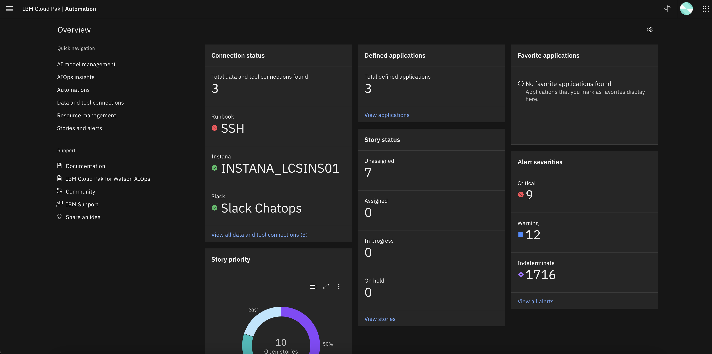

    When you first open CP4WAIOps, you are taken to the homepage that displays the most important information that you have access to. Depending on your credentials, different "widgets" will appear for you to see and act on.

    The terms and concepts on this homepage may seem foreign at first, but they will become clear throughout the rest of this tutorial. A good place to start is on the AIOps Insights page where you can see a good overview of the CP4AIOps benefits.

#### AIOps Insights

81. **Expand the menu by clicking the button in the top-left corner of the page, then navigate to the AIOps Insights page.**

    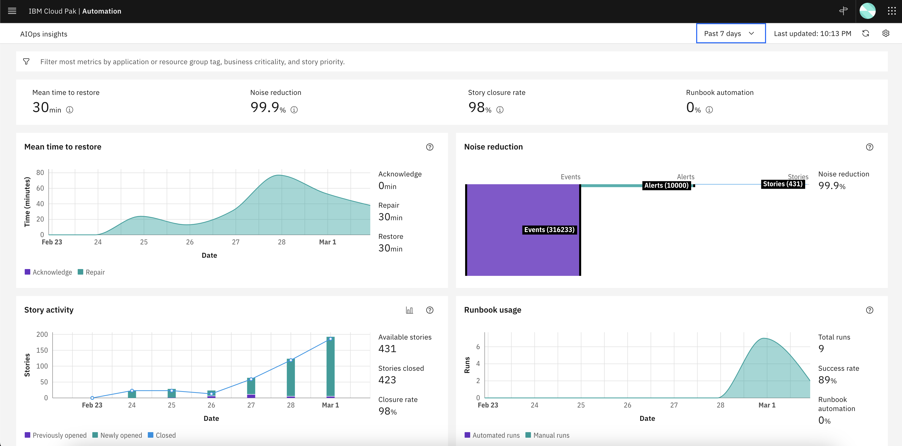

    On this page, we see visualizations of two of the main goals of CP4WAIOps - Improved Mean Time to Restore (MTTR) and Reduction of Noise.

    **Mean Time to Resolution (MTTR)** is the total time period from the start of a failure to when the failure resolves and operations resume. For business-critical applications, downtime of just a few minutes can mean thousands or millions of dollars' worth of lost revenue. IBM Cloud Pak for Watson AIOps reduces MTTR by using AI-driven insights to recommend actions and runbooks to solve the issue more quickly.

    **Noise Reduction** is the concept of reducing the number of IT events and alerts that your operations staff must evaluate, speeding recovery time and reducing employee fatigue.

    In the image above, over 300,000 events were narrowed down to 10,000 alerts, which were further narrowed down to 431 stories. These stories are what IT Operations staff needs to evaluate and remediate either through manual processes, or by building automation if stories are repeating.

    Some terminology:

    - **Events** are a record containing structured data that summarizes key attributes of an occurrence on a managed entity, which might be a network resource, some part of that resource, or other key element associated with your network, services, or applications.

        An event might or might not indicate something anomalous and is a point-in-time, immutable statement about the entity in question.

    - **Alerts** represent an ongoing anomalous condition against a single managed entity. Unlike events, alerts might evolve over time as the condition changes. Alerts have a start and an end time. The creation and evolution of alerts are informed by events.

    - **Stories** represent the context around an issue that is currently severely impacting operations. A story includes all alerts that are related to the issue and information about how the affected resources are related. The creation and evolution of stories are informed by alerts.

    Next, you will take a look at where all of these events are coming from.

#### Data and Tool Connections

82. **From the left-side menu, navigate to Data and Tool Connections.**

    

    While there are three connections configured, only the `Instana` connection is a source of data into the cluster. All of the data, events, and metrics you will see in CP4WAIOps is coming from the Instana server you explored earlier in this tutorial. `Slack` and `SSH` are both connections where CP4WAIOps sends information, notifications, and commands which will be discussed in a later section. 

    Therefore over the course of one week, over 300,000 events have come from only one data source and logs are not even enabled. This is an extremely vast quantity, but pales in comparison to what would be generated by enterprise business applications running in multiple systems with logs enabled.

#### Resource Management

83. **From the left-side menu, navigate to Resource Management.**

    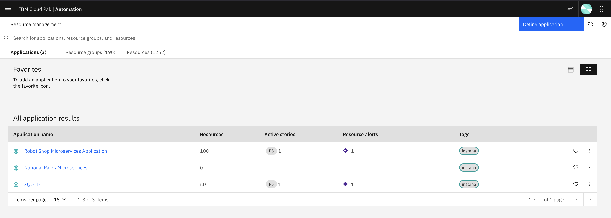

    Similar to Turbonomic, you will see that CP4WAIOps integrated the Instana Application Perspectives.

84. **Click the link for the Robot Shop Microservices Application.**

    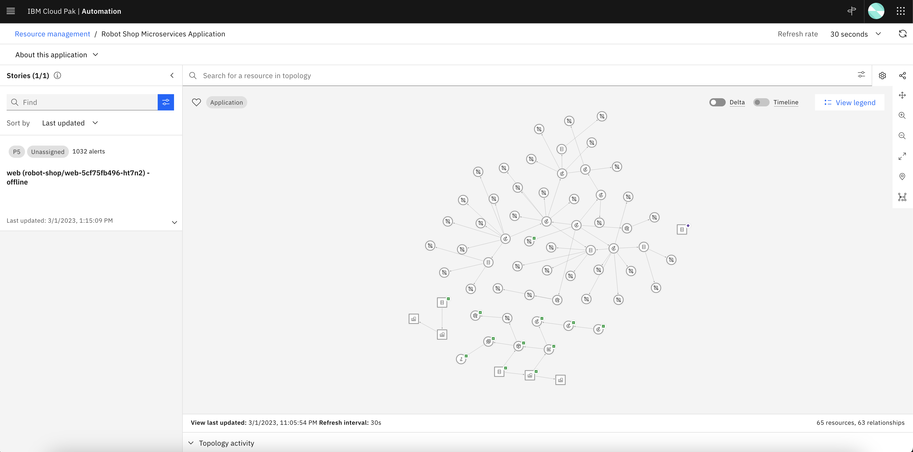

    You now have a scoped view of just the resources associated with the Robot Shop Microservices Application - all of the Kubernetes objects such as pods, services, and routes, but also the individual application components within the containers such as `.jar` files and even the API calls made to each endpoint. 

    You also might also see some *stories* in this view if they are associate with the application. We will look more at these later on.

#### Automations

85. **From the left-side menu, navigate to Automations**. If there are any filters applied, click the Clear Filters button to see all of the Policies.

    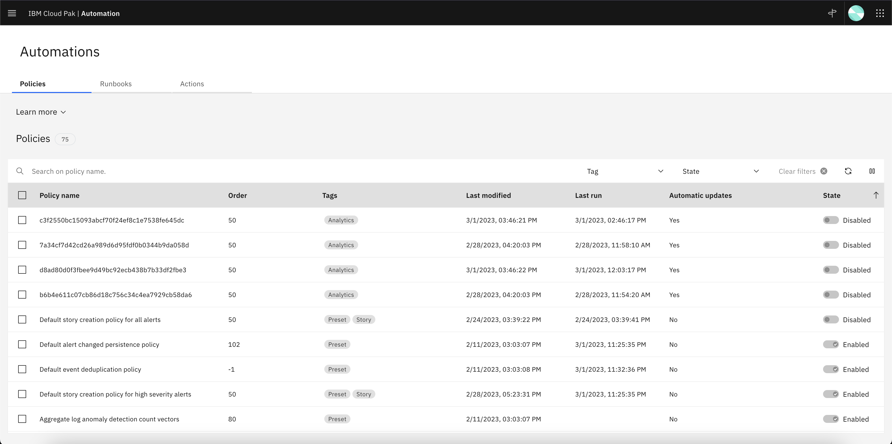

    The automation tools - policies, runbooks, and actions - help you resolve incidents quickly by setting up and enabling an automatic response as situations arise. Starting up additional capacity or restarting a failed service can happen before your team knows there is an issue.

    **Policies** are rules that contain multiple condition and action sets. They can be triggered to automatically promote events to alerts, reduce noise by grouping alerts into a story, and assign runbooks to remediate alerts.

86. **For example, find the Policy named "Disk Pressure", and click on it. In the new page that opens, click the "Specification" tab.**

    This policy looks for alerts that match the tags `Value of:alert.summary` contains `KubeletHasDiskPressure`, or `Value of:alert.summary` contains `You will run out of disk space`. Alerts with either of these tags indicate that an OpenShift node is running out of ephemeral storage and will soon begin evicting pods.

    The policy also stats what should happen when the policy finds a matching alert. In this case, it will promote the alert to a story that will notify specific users responsible for fixing the issue, or potentially automatically run a runbook made up of one or more actions that have been defined in CP4WAIOps.

87. **Navigate to the "Runbooks" tab on the Automations page.**

    

    **Runbooks** automate procedures that do not require human interaction, thereby increasing the efficiency of IT operations processes. Runbooks are made up of one or more actions that can be taken against a target environment through either ssh or HTTP calls.

    You can also switch to the "Activities" tab to see all of the previous runbook usage.

88. **Navigate to the "Actions" tab on the Automations page.**

    **Actions** in runbooks are the collection of manual steps grouped into a single automated entity. An action improves runbook efficiency by automatically performing procedures and operations.

89. **For example, click the "Turn off payment erroneous calls" action and then click the "Content" tab of the new window that pops up.**

    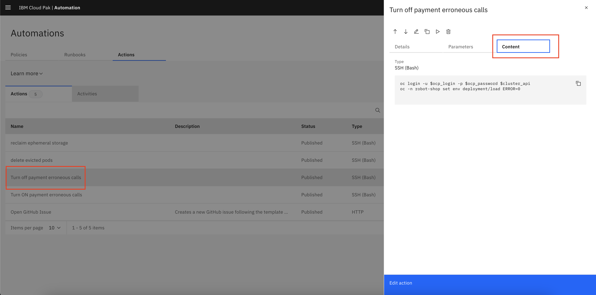

    This action enables CP4WAIOps to `ssh` to a target server and run the `oc` commands that would be possible if you were to `ssh` there yourself. This action takes advantage of the `SSH` Data connection that we saw in an [earlier section](#data-and-tool-connections).

    There are other alternatives to `ssh` - HTTP API calls or Ansible automation playbooks, for example.

    Runbook and actions can be associated with Stories as well, so that whenever a story is created that meets certain criteria, a runbook can automatically kick off problem remediation.

#### Stories and Alerts

90. **In the left-side menu, navigate to "Stories and Alerts".**

    

    Depending on what alerts are triggered at the time you go through the tutorial, the current stories will look different.

    Stories are where the IT Operators and administrators should focus their attention to either manually close stories as they are generated or build actions and runbooks in order to remediate stories automatically as they appear. 

91. **If there is a story created for "Erroneous call rate is too high", click it to open that specific story. If it is not available at the time, you can select any other story to see similar information.**

    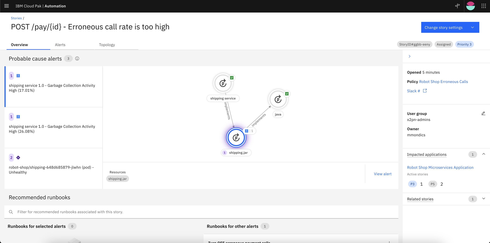

    The erroneous calls error is the same issue that you looked it back in the [Instana section](#using-instana-to-identify-an-issue). Now we can see Instana and CP4WAIOps integrating well together - Instana observability identified the error and its root cause, and CP4WAIOps has not generated a story that can be used to remediate the problem in an automated way.

    The story contains many pieces of information that can be used to more quickly remediate issues.

    - Probable cause alerts - CP4WAIOps attempts to derives the root fault component, and the full scope of components that are affected by an incident.
    - Topology - provides a view of the affected components so IT Operators can see the incident in context.
    - Assignees - you can either manually assign stories to team members to resolve, or CP4WAIOps can assign people or teams automatically if a policy is configured to do so.
    - Recommended runbooks - if CP4WAIOps correlates the story with others from the past that were resolved with certain playbooks, they will be recommended.
  
#### ChatOps

Earlier in the tutorial, you saw that Slack is configured as a ChatOps endpoint for this CP4WAIOps instance. 

**ChatOps** is used to provid a messaging-based interface for quickly reporting incidents to the relevant IT Operations teams who are responsible for remediating the issue. This helps to improve MTTR by getting the relevant incidents in front of the correct people in near-real time.

Slack or Microsoft Teams can be used as ChatOps endpoints, so organizations can use their pre-existing tooling rather than needing to adopt and learn a new messaging platform.

See the example ChatOps notification below.

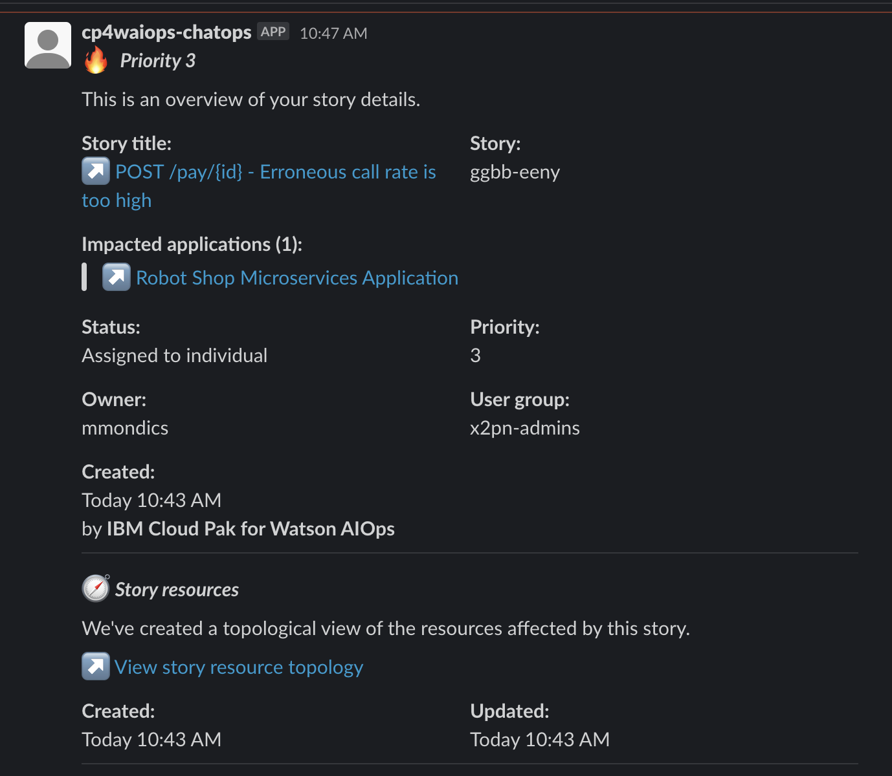
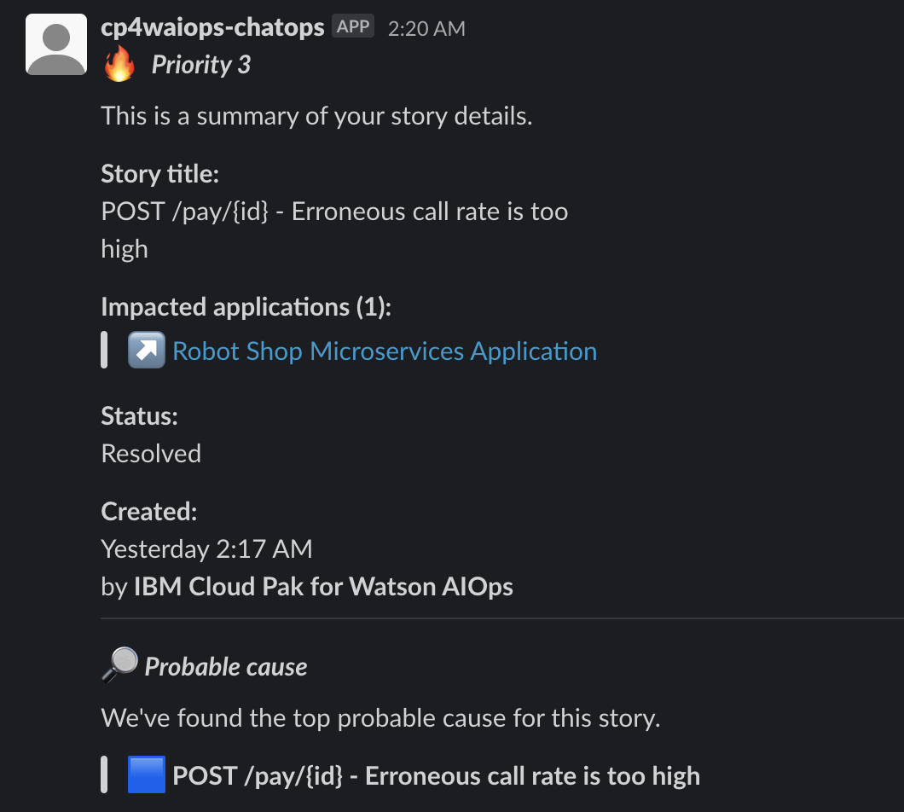
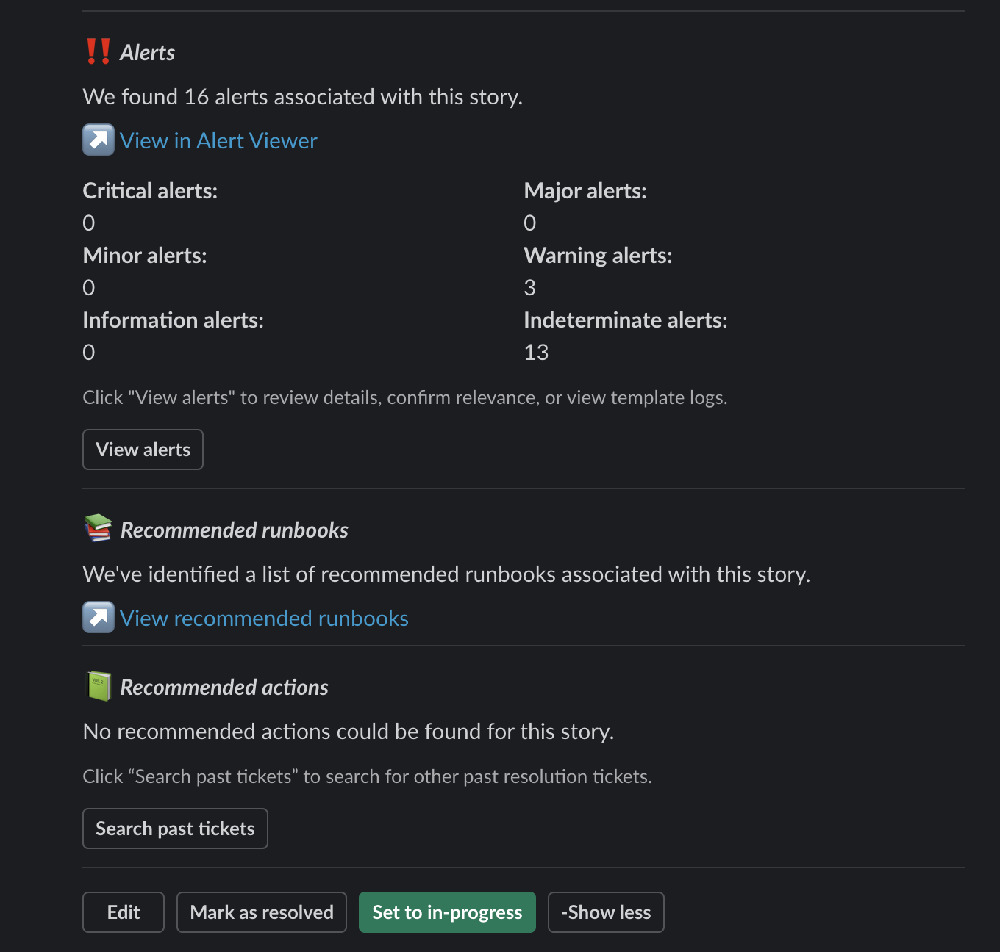

#### AI Model Management

Throughout this tutorial, you may have been asking yourself, "Where's the AI in IBM Cloud Pak for AIOps?" This section will show you the AI models that come pre-loaded with CP4WAIOps and the benefits they provide.

92. From the left-side menu, navigate to "AI Model Management".

    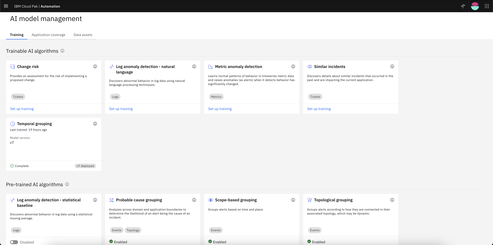

    This page allows you to train the pre-loaded AI models to hone their ability to derive insights from your incoming data connections (Instana in this tutorial). 

    For example, the *Temporal grouping* AI model groups alerts which co-occur over time. When a problem arises, there are typically multiple parts of a system or environment that are impacted. When alerts in different areas co-occur, it makes sense to look at them together and treat them as one problem to try and determine what might have happened. This is one of the ways that noise is reduced from the hundreds of thousands of events all the way down to a few hundred stories.

93. Click the "Temporal grouping" tile.

    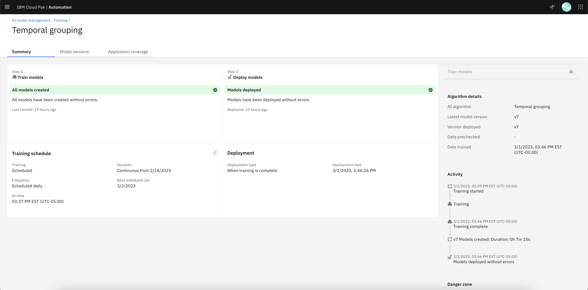

    You can see the status and history of the AI model training as well as the applications that it is being applied to. Users with elevated credentials are able to manually kick of training to improve the AI model, as well as set up a schedule to automate training on a consistent basis.

## Wrapping Up

In this demonstration, you have seen some of the capabilities of IBM's AIOps portfolio and how it can observe and manage OpenShift on IBM zSystems application. This tutorial only touched the surface of the capabilities of Instana, Turbonomic, and IBM Cloud Pak for Watson AIOps. Each of these solutions can do much more than was covered in this tutorial, and they also support many more technologies than just OpenShift and containerized applications.

We encourage you to look through the references below and reach out to this [tutorial author](mailto:matt.mondics@ibm.com) if you would like to see or learn more.

## References

- [Instana Product Page](https://www.ibm.com/products/instana)
- [Turbonomic Product Page](https://www.ibm.com/products/turbonomic)
- [IBM Cloud Pak for Watson AIOps Product Page](https://www.ibm.com/products/cloud-pak-for-watson-aiops)

- [Instana Documentation](https://www.ibm.com/docs/en/instana-observability/current)
- [Turbonomic Documentation](https://www.ibm.com/docs/en/tarm)
- [IBM Cloud Pak for Watson AIOps Documentation](https://www.ibm.com/docs/en/cloud-paks/cloud-pak-watson-aiops)

- [Instana Supported Technologies](https://www.ibm.com/docs/en/instana-observability/current?topic=supported-technologies)
- [IBM AIOps YouTube Series](https://www.youtube.com/c/IBMSupportTV/search)